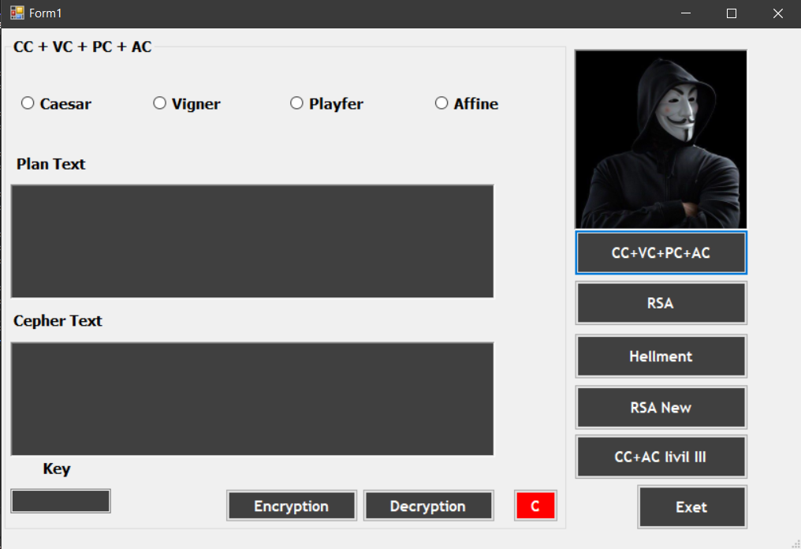
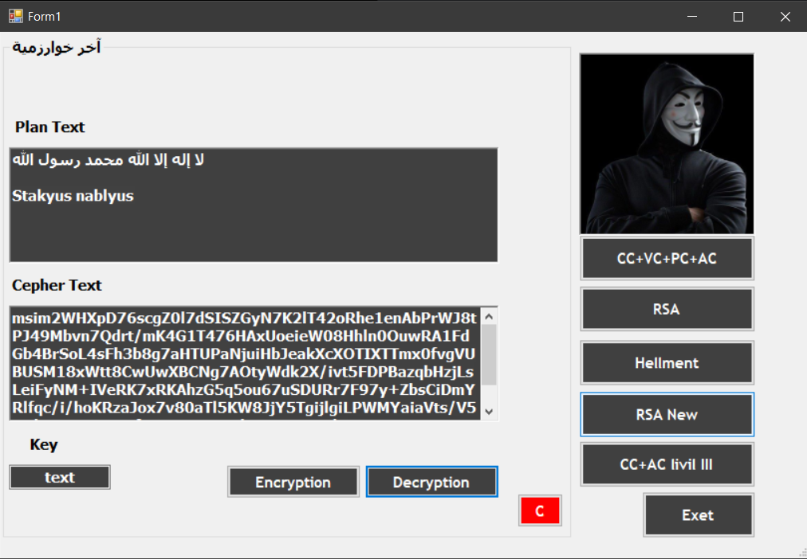

<h4>The first interface we used the RSA algorithm which encrypts all files, whatever they are and of any size, except that when encrypting large files, the interface freezes a little and then returns to normal and the process is completed successfully. As for the second interface, you go to it by pressing the NEXT button, and this interface has many encryption algorithms for texts that I developed, including the Caesar and Avine algorithms found in the last button of the interface CC + AC level III and made them form a very strong algorithm where the user chooses any text file, whether PDF, presentation or anything else, and whether it is in any language, Arabic or English, or whether there are any signs in the texts such as *, #, @, !, %, &, (, ), +, =, | And many of the signals, if they exist, nothing will happen to them and only the texts will be encrypted while preserving the location of the texts, spaces and lines, and the excellent algorithm that comes before it and was developed by me, where I developed the RSA algorithm, which is called RSA New in the second interface, where this algorithm encrypts many texts in English and Arabic at the same time, where all you have to write anything in your head or paste any of the important texts you have, even if it consists of 1,000,000 words in both languages, it will be encrypted in an encrypted text written in the hexadecimal system consisting of only 64 bits, and where when this encrypted text is copied and decrypted, everything that was written before the encryption will be returned without subtracting any letter from the original text.</h4>

<h2>Main interface: RSA algorithm for encrypting all small and large files</h2>

<b>To use this interface to encrypt large and small files, you must first select the file you want to encrypt by clicking the "..." button opposite the input field in the middle of the interface. Then, enter an encryption password. The password must be 16 characters long, symbolic, or text-based. This means that the file to be encrypted will only be encrypted if a password is created that is 16 characters long and cannot be increased or decreased. The encryption will only be decrypted with the same password used for encryption.</b>

<h3>Important note</h3>

<b>When encrypting large files, you will notice that the program interface freezes for a few seconds. Leave it as it is and it will automatically reboot and complete the file encryption because the freeze occurs due to encrypting a large file. The same thing happens when decrypting.</b>

  

<h2>The main facade of the second project</h2>

<b>When you click the next button, the last project will be displayed, which contains text encryption algorithms and text files.. including those that I developed to make the algorithm of great importance in work and its strong and difficult-to-break capabilities in terms of encryption and decryption.</b>

  

<h2Caesar, Vigner, Playfair, and Affin algorithm</h2>

  

<h2>RSA algorithm generates public and private encryption and decryption keys</h2>

  

<h2>Hellman algorithm is the same as RSA for creating private keys for security.</h2>

  

<h2>The new RSA algorithm that I invented</h2>

<b>The new RSA algorithm I invented encrypts all texts, whether Arabic or English, and can accept more than 2 million lines or words of Arabic and English text together, or Arabic alone, or English alone. The user can choose. When encrypting, all texts are encrypted. Even if there are a million texts, they will be encrypted, and the encrypted text will be output as a 64-bit text. When decrypting, all written text will be returned as it was before.</b>

  

<h2>Advanced encryption algorithm Caesar and Alfaine algorithm in pre-encryption state</h2>

<b>The encryption algorithm that I developed, which is a combination of the Caesar and Affin algorithms, and this interface encrypts text files from Arabic and English together or each language separately as the user wishes, as the files of type txt or any other text files are encrypted, and when encrypting, all symbols in the file will be taken into account, such as *, #, @, !, %, &, (, ), +, =, | and many emojis, in short, the text inside the file will be encrypted, taking into account all symbols, lines and spaces, and even when decrypting, the same thing happens</b>

  

<h2>Advanced encryption algorithm Caesar and Alfaine algorithm in the post-encryption state</h2>

  

